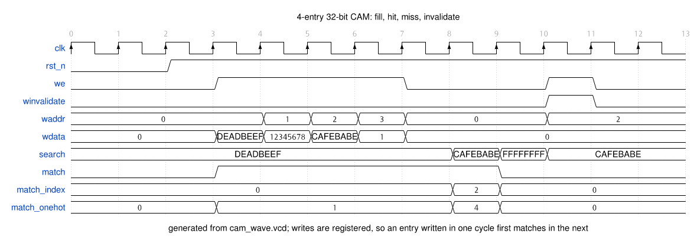
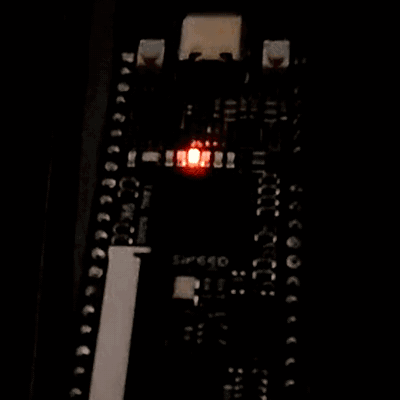

# 4-entry 32-bit CAM

A content-addressable memory in SystemVerilog: simulated, run on a Tang Nano 9K,
and paired with an LLVM pass that counts memory operations.

The CAM is the main piece. Two parts go beyond a plain testbench: the timing
diagram is generated from the simulation instead of drawn by hand, and the module
runs on a real board with its output diffed against the simulator.

All open-source tools.

```
Makefile        every build and check target (run `make` for the list)
hardware/
  cam.sv        4-entry, 32-bit CAM
  tb_cam.sv     testbench, 10 self-checking assertions
  waves/        timing diagram, generated from the simulation VCD
  fpga/         the same CAM running on a Tang Nano 9K
software/
  CountMemOps.cpp  the pass
  test.c           sample input
  run_pass.sh      build the plugin and run it over test.c
  CMakeLists.txt   plugin build
```

## Why a CAM

A Content-Addressable Memory is searched by *content*, not address: present a key
and it reports whether any valid entry holds it, and which one. That is the same
associative lookup a DFI tag store needs when it checks an address against its
protected set in a single cycle.

## Hardware: the module

[`hardware/cam.sv`](hardware/cam.sv) is parameterised on depth and width and
defaults to 4 x 32.

Write port (registered): `we`, `waddr`, `wdata`, `winvalidate`.
Search port (combinational): `search` in; `match`, `match_index`, `match_onehot` out.

Every entry carries a valid bit, so an entry that was never written, or was
invalidated, can never match. `match_index` reports the *lowest* matching index,
which keeps the result defined when the same key is stored twice.

## Hardware: simulation

```bash
make sim          # needs iverilog with -g2012
```

```
PASS  empty -> miss              key=aaaaaaaa  match=0 idx=0
PASS  hit entry 0                key=deadbeef  match=1 idx=0
PASS  hit entry 1                key=12345678  match=1 idx=1
PASS  hit entry 2                key=cafebabe  match=1 idx=2
PASS  hit entry 3                key=00000001  match=1 idx=3
PASS  unknown key -> miss        key=ffffffff  match=0 idx=0
PASS  old value gone             key=12345678  match=0 idx=0
PASS  new value hit              key=99999999  match=1 idx=1
PASS  invalidated -> miss        key=cafebabe  match=0 idx=0
PASS  duplicate -> lowest idx    key=deadbeef  match=1 idx=0

10 checks, 0 errors
ALL PASS
```

The cases cover an empty CAM, a hit on every entry, an unknown key, overwriting an
entry so the old key stops matching, invalidation, and duplicate-key priority.

## Hardware: timing



`make waves` generates this from the simulation's VCD, so the values are the
simulator's. Two details it makes explicit:

- The write port is registered, so `DEADBEEF` is written in cycle 3 and first
  matches in cycle 4.
- Invalidation behaves the same way: entry 2 is invalidated in cycle 10 and stops
  matching in cycle 11.

`cam_wave.vcd` is kept so the same run can be opened in GTKWave, and the per-cycle
table printed while generating it is a text log of the same run.

## Hardware: on the FPGA

[`hardware/fpga/`](hardware/fpga/) synthesises the CAM for a Tang Nano 9K (Gowin
GW1NR-9C) and runs it on the board. It preloads four entries, then cycles through
search keys at about 1 Hz, showing each result on the LEDs and reporting it over
UART.



The LEDs step through the key list once a second. A hit lights the match LED plus
the matched index; a miss lights the miss LED instead. Same run, in text, in the
verification section below.

```bash
make flash        # synthesise, place and route, pack, load onto the board
make verify-hw    # capture the board's UART and diff it against simulation
```

Programming targets SRAM, so the bitstream is lost when the board is unplugged;
re-run `make flash` after replugging, or `make flash PERSIST=1` to write it to
the board's flash instead.

Cost on the device: 355 LUT4 (4% of the part), 137 flip-flops, timing closed at
60 MHz against the 27 MHz clock.

### Verification against simulation

LEDs alone are not much of a claim, so the design also reports each search over
UART. That makes the hardware result directly comparable to the simulator:

```
key=FFFFFFFF match=0 idx=0
key=12345678 match=1 idx=1
key=00000000 match=0 idx=0
key=CAFEBABE match=1 idx=2
key=00000001 match=1 idx=3
key=AAAAAAAA match=0 idx=0
key=DEADBEEF match=1 idx=0
```

`make verify-hw` captures a full pass of that sequence from the serial port, runs
the same design in simulation, and diffs the two:

```
PASS: board output matches simulation (8 lines)
```

### Preloaded entries and key sequence

| index | entry |
|------|-------|
| 0 | `0xDEADBEEF` |
| 1 | `0x12345678` |
| 2 | `0xCAFEBABE` |
| 3 | `0x00000001` |

Keys, in order: `DEADBEEF` (hit, 0), `FFFFFFFF` (miss), `12345678` (hit, 1),
`00000000` (miss), `CAFEBABE` (hit, 2), `00000001` (hit, 3), `AAAAAAAA` (miss),
then it repeats.

### LEDs and buttons

| LED | meaning |
|-----|---------|
| 4 | match: the current key is in the CAM |
| 3 | miss: it is not |
| 2 | tick, so the sequence is visibly advancing |
| 1:0 | matched index in binary, meaningful on a hit |

The LEDs are active low on this board; the RTL inverts them, so a lit LED means
the signal is asserted.

| button pin | function |
|------------|----------|
| 3 | reset: restart from the first key |
| 4 | hold to pause on the current key, release to continue |

Pause has to be held across a step (about a second) to be visible, and it stops
the UART lines too. The buttons are silkscreened S1 and S2, but that marking was
revised across board revisions, so the table is by pin number.

## Software: LLVM pass

[`software/CountMemOps.cpp`](software/CountMemOps.cpp) walks every function in a
module and counts load and store instructions, printing per-function numbers and a
module total. It is an out-of-tree plugin for the new pass manager, and it only
reads the IR: it reports `PreservedAnalyses::all()` and changes nothing.

[`software/run_pass.sh`](software/run_pass.sh) builds the plugin, compiles the
sample program to IR, and runs the pass over it:

```bash
software/run_pass.sh
```

The same steps are Makefile targets, plus a check on the numbers:

```bash
make count         # build the plugin, emit IR from test.c, run the pass
make verify-pass   # cross-check the counts against the IR text
```

[`software/test.c`](software/test.c) has four functions chosen so the counts differ
visibly: one that stays in registers, one that only writes, one that only reads,
and one that does both.

```
module: test.ll
  loads  stores  function
      2       2  no_mem
      3       4  stores_only
      8       1  loads_only
     13       8  mixed
      0       1  main
     26      16  TOTAL
```

### Checking the numbers

Rather than take the pass's word for it, `make verify-pass` counts
`load`/`store` lines in the emitted `.ll` independently and compares:

```
pass:  loads=26 stores=16
IR:    loads=26 stores=16   (counted from test.ll independently)
PASS: counts agree with the IR
```

### Where in the pipeline you count matters

`no_mem` is just `a * b + 1`, yet at `-O0` it reports two loads and two stores.
That is real: at `-O0` clang spills parameters to stack slots and reloads them, and
the pass is faithfully counting the IR in front of it. Running the same code at
`-O2`, after `mem2reg` promotes those allocas to registers, gives:

```
      0       0  no_mem
      0       3  stores_only
      1       0  loads_only
     22      11  mixed
     23      14  TOTAL
```

`no_mem` drops to nothing, and `loads_only` collapses to a single wider load. The
count is a property of the IR at a particular point in the pipeline, not of the
source. Anything that instruments memory accesses has to be placed deliberately
for that reason: running before `mem2reg` tags stack traffic that will not survive
optimisation, and running after vectorisation sees merged accesses rather than the
individual ones the program wrote.

## Tools

| tool | used for |
|------|----------|
| make | driving every step below |
| Icarus Verilog | simulation (`-g2012` for SystemVerilog) |
| yosys, nextpnr-himbaechel, Apicula, openFPGALoader | FPGA synthesis through flashing |
| [vcd2wavedrom](https://github.com/Toroid-io/vcd2wavedrom), wavedrom-cli | generating the timing diagram from the VCD |
| GTKWave | optional, for inspecting `cam_wave.vcd` |
| clang / opt / LLVM 14 + CMake | building and running the LLVM pass |

The FPGA tools all ship in the
[OSS CAD Suite](https://github.com/YosysHQ/oss-cad-suite-build); put its `bin` on
`PATH` before running the scripts. `vcd2wavedrom` installs with
`pip install git+https://github.com/Toroid-io/vcd2wavedrom`, and `wavedrom-cli`
runs through `npx`.

Third-party code is listed in [THIRD_PARTY.md](THIRD_PARTY.md).
